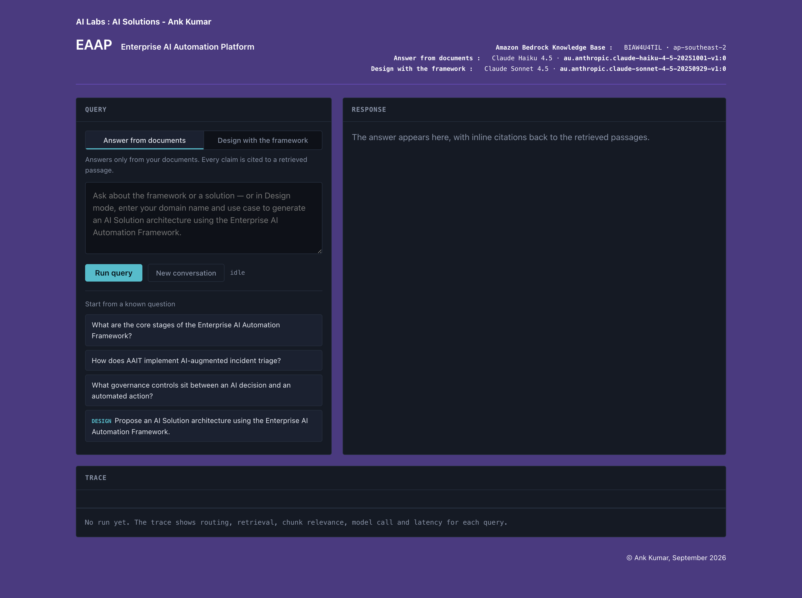

# EAAP — Enterprise AI Automation Platform

A learning platform exploring enterprise AI orchestration, knowledge retrieval, and governed decision-making patterns using the **Enterprise AI Automation Framework (EAAF)**.

## What I Built

**EAAP** demonstrates how to apply EAAF—a domain-independent reference architecture—to real-world AI-assisted decision systems. It ingests EAAF theory and six reference implementations (AAIT, SCDO, AAMP, FDAB, TANAOP, BMRS) into an Amazon Bedrock Knowledge Base and uses LLM reasoning to design new solutions in any domain.

## Architecture

- **Backend**: FastAPI + Amazon Bedrock (Knowledge Base BIAW4U4TIL, ap-southeast-2)
- **Models**: Claude Haiku 4.5 (grounded QA) + Claude Sonnet 4.5 (solution design)
- **State**: SQLite session memory with signed cookies
- **Frontend**: Responsive HTML/CSS/JS with streaming SSE, trace telemetry, chunk inspection

## How It Works

### Query Mode
Answer questions directly from the EAAF corpus. Every claim is cited to retrieved passages.

### Design Mode
Propose AI solution architectures for new domains. The system retrieves EAAF patterns, constructs decision context, and generates structured architectures with framework citations.

### Trace Panel
See exactly what happened: retrieval latency, chunk relevance scores, model selection, token counts, and stage timing.

## Running EAAP

```bash
cd ~/projects/ey-rag-multiagent
source .venv/bin/activate
uvicorn app:app --port 8000
```

Open `http://localhost:8000`.

## Enterprise AI Automation Framework (EAAF)

EAAF defines a reusable signal-to-action pattern for enterprise AI systems across domains.

Six reference implementations instantiate this pattern:

- **AAIT**: IT Operations (Incident triage)
- **SCDO**: Supply Chain (Demand optimization)
- **AAMP**: Automotive (Maintenance planning)
- **FDAB**: Banking (Fraud detection)
- **TANAOP**: Telecom (Network assurance)
- **BMRS**: Defence (Munitions replenishment)

## Author

Ank Kumar | AI Labs: AI Solutions

## Screenshots

### Query Mode



## Reference Architectures

Generated using EAAP Design Mode:

- [Governance Solution](docs/screenshots/EAAP%20—%20Enterprise%20AI%20Automation%20Platform_Governance.pdf)
- [Healthcare Prescription Refill](docs/screenshots/EAAP%20—%20Enterprise%20AI%20Automation%20Platform_Healtcare_Prescriptio_Refill.pdf)
- [General](docs/screenshots/EAAP%20—%20Enterprise%20AI%20Automation%20Platform.pdf)

